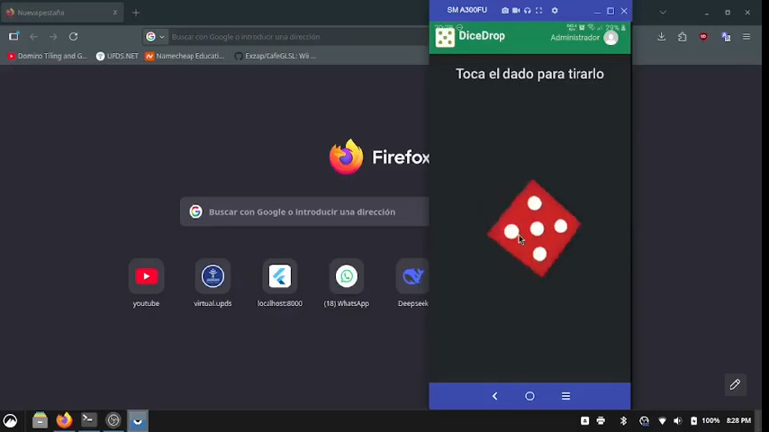
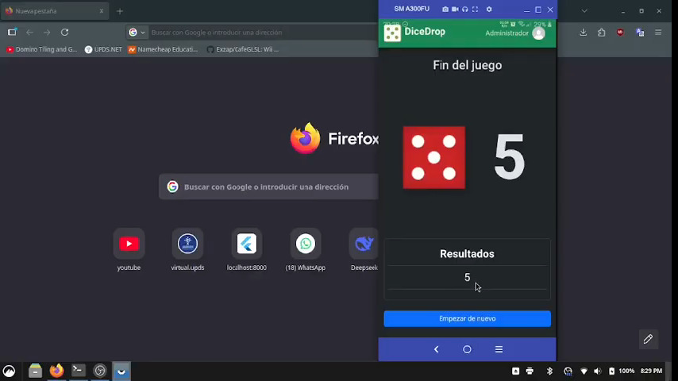
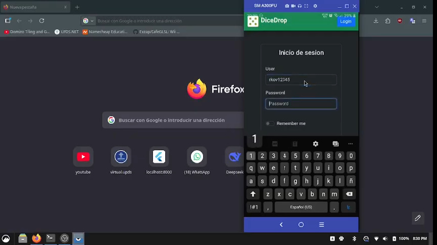
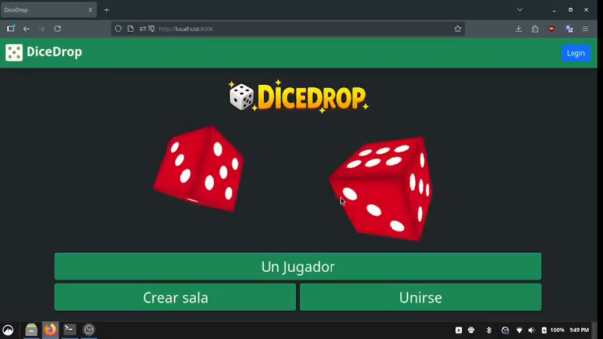

# Actividad Final - Aplicaciones Móviles

## Juego de dado
Esta aplicacion consiste en un juego donde tiras un dado y te sale un resultado aleatorio entre 1 a 6, tiene el modo singleplayer y multiplayer, puede iniciar sesion, crear sala, unirte a una sala, etc. Esta realizado en tauri, es una aplicacion PWA por lo que funciona tanto en dispositivos moviles como en navegador.
---
## 1. Pantalla de inicio

## 2. Modo singleplayer

## 3. Resultados singleplayer

## 4. Login

## 5. Sala multiplayer

## 6. Comparacion de resultados multiplayer

## 7. Aplicacion ejecutandose en navegador

**Autor:** Rafael Kadir Oporto Valencia